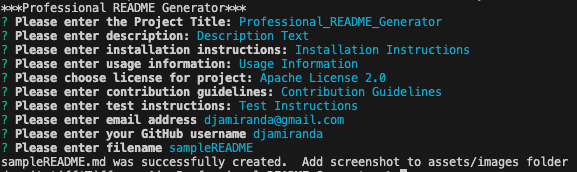

# Professional_README_Generator
  
  
  ## Description:
  Description Text

  
  
  ## Table of Contents:
  - [Installation](#Installation)

  - [Usage](#Usage)
  
 * [License](#license)

  - [Contributing](#Contributing)
  
  - [Tests](#Tests)

  - [Questions](#Questions)

  ## Installation:
  Installation Instructions
  
  ## Usage:
  Usage Information
  
  ## License:

https://opensource.org/licenses/Apache-2.0

  ## Contributing:
  Contribution Guidelines
  
  ## Tests:
  Test Instructions
  
  ## Questions:
  
  For any additional questions:
  
  Email:
  djamiranda@gmail.com
  
  GitHub:
  [https://github.com/djamiranda](https://github.com/djamiranda)
  
  Repo:
  [https://github.com/djamiranda/Professional_README_Generator](https://github.com/djamiranda/Professional_README_Generator)

